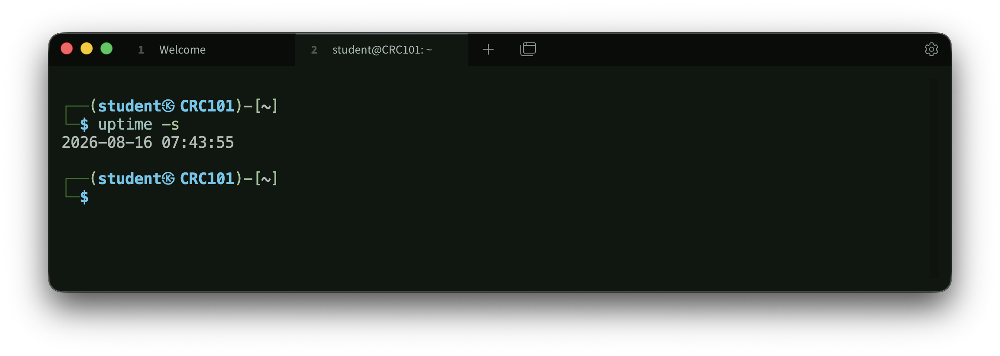
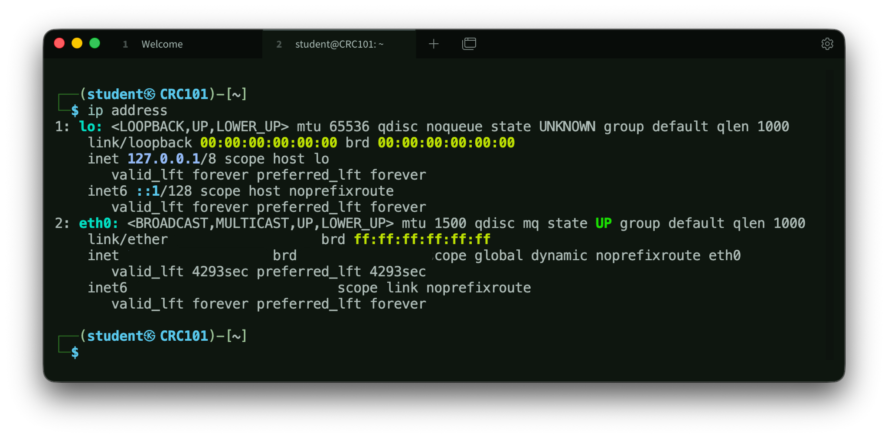
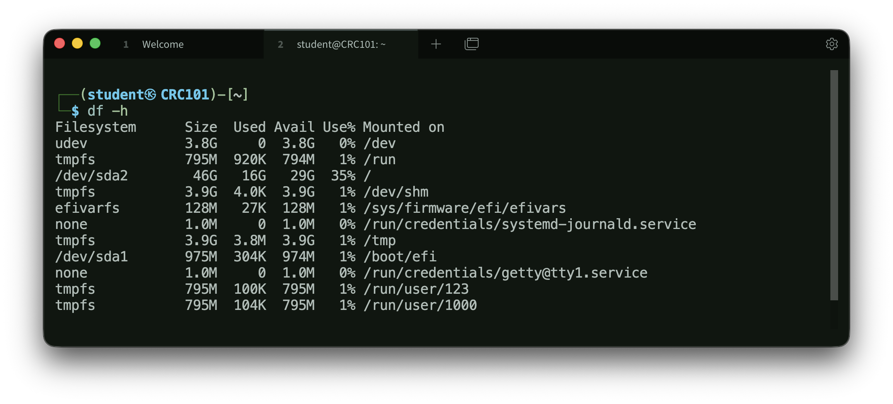
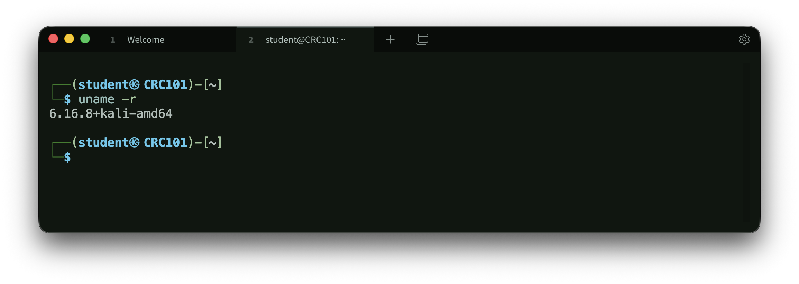
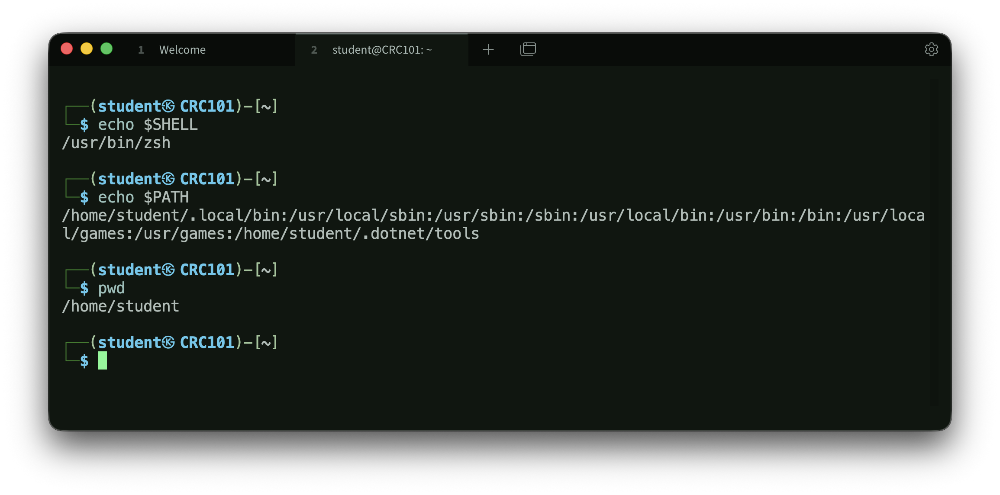
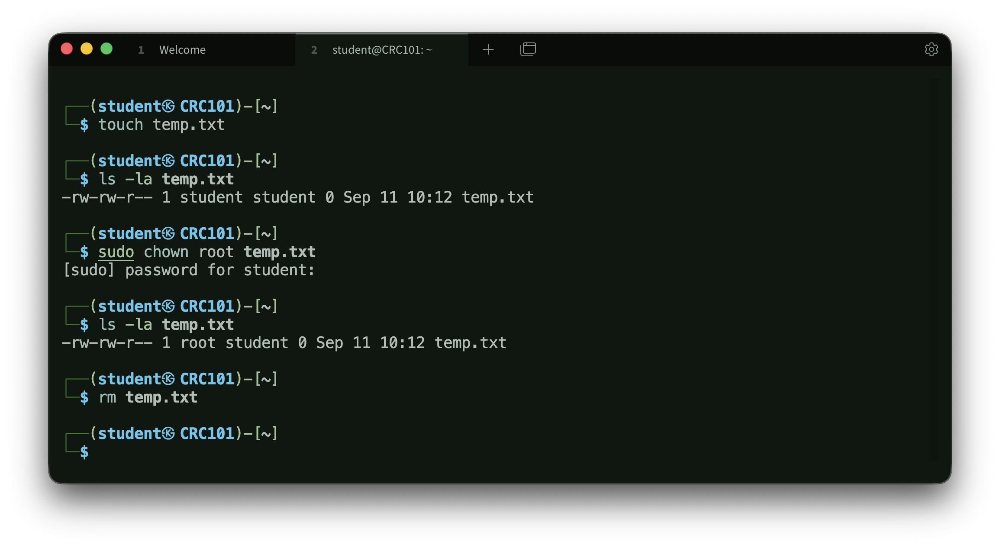

# Linux Fundamentals

In this lab, I practiced basic Linux commands in Kali Linux and spent time understanding what the output actually meant. This page summarizes the main commands I worked with and what I learned from them. The screenshots show selected results, with network identifiers removed before publishing.

## Checking System Start

```bash
uptime -s
```

This command showed the date and time when the system was last started. I learned that `uptime` can provide more than the amount of time a system has been running; the `-s` option gives the exact start time.



## Viewing Network Information

```bash
ip addr
```

I used `ip addr` to view the network interfaces on my Kali system and find their assigned IP addresses. The output also showed whether each interface was active.

This exercise also helped me practice reading CIDR notation. For example, an address ending in `/24` uses the first 24 bits for the network portion. The assignment used the older term "Class C," but `/24` is the notation I am more likely to see today.



## Checking Disk Space and Directory Size

```bash
df -h
du -sh <directory>
```

This exercise clarified the difference between two similar commands. `df -h` shows the used and available space on mounted filesystems, while `du -sh` shows how much space a particular directory uses. The `-h` option makes the sizes easier to read.



## Finding the Kernel Version

```bash
uname -r
```

This displayed the version of the Linux kernel running on the system. This information can be useful when checking software compatibility or researching whether a system needs a security update.



## Looking up a Domain Name

```bash
dig example.com
```

I used `dig` to see how a domain name resolves to an IP address. The output included the returned DNS records and information about the DNS server that answered the request. I used `example.com` here instead of including details from the lab environment.

## Learning the Filesystem Structure

I also reviewed several common Linux directories:

| Path | What I learned |
| --- | --- |
| `/` | The starting point of the filesystem |
| `/home` | Where regular users usually have their home directories |
| `/etc` | Where many system configuration files are stored |
| `/var/log` | A common location for system and service logs |
| `/tmp` | Used for temporary files |
| `/usr/bin` | Contains many commands and executable programs |
| `/root` | The root user's home directory |

Reviewing the filesystem structure helped me better understand where configuration files, programs, and logs are normally stored.

## Checking My Current Directory

```bash
pwd
```

`pwd` stands for "print working directory." It displays the full path of the directory I am currently in. This is a simple command, but it is helpful to check my location before working with files.

## Understanding Environment Variables

```bash
echo "$SHELL"
echo "$PATH"
```

I learned that an environment variable is a named value used by the shell and other programs to store configuration information. `SHELL` usually shows the account's configured login shell.

`PATH` contains the directories the shell searches when I enter a command without its full location. For example, when I type `ls`, the shell searches the directories listed in `PATH` to find the executable. This helped me understand why adding a program's directory to `PATH` allows it to be run by name.



## File Ownership and Deletion

For the final exercise, I created an empty temporary file and changed its owner to `root`:

```bash
touch temp.txt
ls -l temp.txt
sudo chown root temp.txt
ls -l temp.txt
rm temp.txt
```

I needed `sudo` to change the owner because changing file ownership is a privileged action. I could still delete the file without `sudo`, which showed me that deleting a file depends mainly on the permissions of the directory containing it, not only on who owns the file itself.



## What I Took Away from the Lab

The biggest takeaway for me was that knowing a command is only the first step. I also need to understand what its output means and why I would use it. This lab gave me a stronger foundation in navigating Linux, checking system and network information, and understanding how ownership and permissions work.
